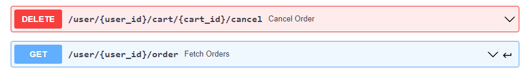

# Picus Security Golang Bootcamp - Final Project

This is a simple e-commerce REST API project which is written in Go programming language.


## 1. Description

The application is AddtoCart REST API which have following features

* **Sign-up** 

User can register to system.

* **Login**

User can login the system, and system will return JWT token to the user.

* **Create Bulk Category**

Admin can create product category by uploading csv file to system.

* **List Category**

User, admin and guest can list the product categories from database

* **AddToCart**

User and admin who has JWT token which is not expired yet can add an item to cart.

* **List Cart Items**

User and admin can list their cart items which are added.

* **Update/Delete Cart Items**

User and admin can delete an item or update quantity of the item.

* **Complete Order**

User and admin can create an order with items that are added to cart.

* **List Orders**

User and admin can list their past orders.

* **Cancel Order**

If cancelation date is not passed which is 14 days from creation date of order, user and admin can cancel the order. If 14 days passed, the request will be invalid.

* **Create Product**

Admin can create a product.

* **List Products**

User, admin and guests can list the products from database.

* **Search Product**

User, admin and guests can search a product in the database with product name and product ID.

* **Delete Product**

Admin can delete single product from database.

* **Update Product**

Admin can update a product in the database.

## 2. Usage

* First prepare your configuration file from ./pkg/config/config-local.yaml

```yaml
ServerConfig:
  AppVersion: 1.0.0
  Mode: Development
  RoutePrefix: /api/v1/ecommerce-api
  Debug: false
  Port: ########
  TimeoutSecs: ########
  ReadTimeoutSecs: ########
  WriteTimeoutSecs: #######

JWTConfig:
  SessionTime: ######
  SecretKey: ######

DBConfig:
  DataSourceName: #######
  Name: ######
  MaxOpen: ######
  MaxIdle: ######
  MaxLifetime: ######
```

* Prepare your database(Postgres)

* ```[console]
  go run main.go
  ```

## 3. Project Details

The Project has 4 main parts:

* 1. cmd

* 2. database

* 3. internal

* 4. pkg

Cmd has server and main functions which the program started from. 

Database will connect to Postgres.

Internal has entities(model and dtos), handlers, service and repository.

Pkg is responsible for other files and folders such as config, middlewares and helpers.

------------------------------------------

The project has 3 layers which are handler layer, service layer and repository layer.

* Handler layer is responsible for communication with client. It receives requests and data from client. After that it validates them and send them into service layer.

* Service layer is the layer which is like a bridge between handler and repository layers. The main objective of service layer is data transformation between handler layer and repository layer. It has also responsible for convertion of data models.

* Final layer is repository layer which is responsible for communicating with database. It saves and sends data which are belongs to client. 

## 4. Technologies Used

The list of technologies (libraries, packages etc.) are:

* [Viper](https://github.com/spf13/viper)
* [Zap](github.com/uber-go/zap)
* [GORM](gorm.io/gorm)
* [Go Postgres Driver](gorm.io/driver/postgres)
* [Google uuid](github.com/google/uuid)
* [Gin](github.com/gin-gonic/gin)
* [JWT](github.com/dgrijalva/jwt-go)
* [Bcrypt](golang.org/x/crypto/bcrypt)
* [Swagger](https://swagger.io)

## 5. Swagger Schemas

The relative endpoints can be seen below screenshot which are created with Swagger.io

* **Api Healthcheck**


* **Product**


* **Category**


* **Cart**




* **Item**


